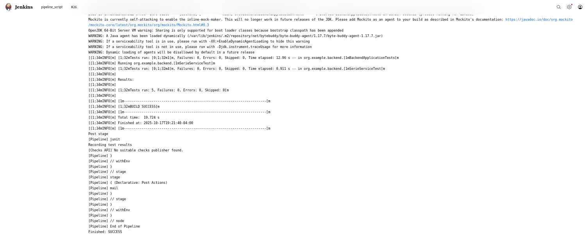
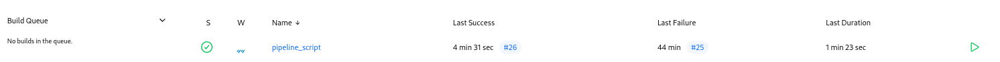

# Website Simple Backend

Backend simple pour la gestion de séries, utilisateurs et recommandations.  
Ce projet fournit des endpoints pour gérer les utilisateurs, séries, historiques, ratings et recommandations.

  

---
### epic 4



---
## 🗂️ Structure du projet
 - ### models/ : Contient toutes les entités (User, Serie, Episode, Ratings)
 - #### repository/ : Interfaces pour accéder à la base de données
 - #### service/ : Logique métier (gestion utilisateurs, séries, recommandations, ratings)
 - #### controller/ : Endpoints REST pour interagir avec le frontend
 - #### exception/ : Gestion des erreurs personnalisées
 - #### security/ : JWT pour authentification

---

## 🔑 Authentification
Le backend utilise JWT pour sécuriser les endpoints.
Pour accéder aux endpoints protégés, envoyez l’Authorization header avec le token :

    Authorization: Bearer <votre_token>
---

## ⚡ Notes
 -  le backend utilisa jwt. pour les test nous avons les password(nom) de 2 users(les 2 première).

---


## 🚀 Installation et configuration

### Cloner le projet
```bash
git clone --branch <branche> https://github.com/Elverovski/QuoiRegarder_backend.git
cd QuoiRegarder_backend
```

### Pré-requis

- Java JDK 17
- Maven 
- Docker 
- Jenkins

## 🐳 Execution aved docker compose
- Build image
```bash
docker compose build
```

- Lancement du stack
```bash
docker compose up -d
```

- Vérifier les services
```bash
docker compose ps
```

- Logs en direct du backend
```bash
docker compose logs -f backend
```

- Arrêt et nettoyage
```bash
docker compose down -v
```
