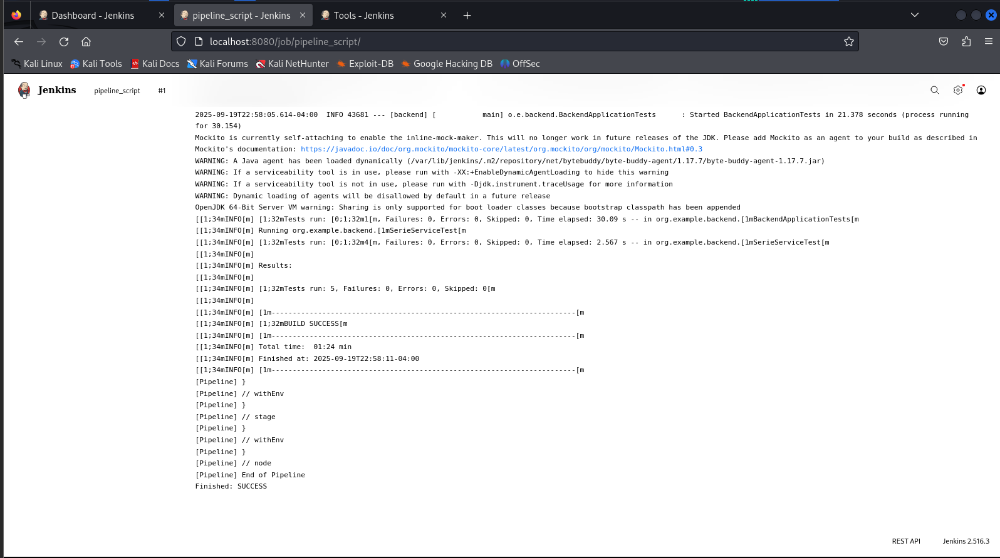
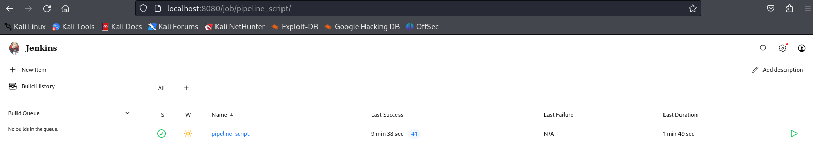

# website_simple_backend

--------------------

=======
## 🥽​​ Installation
- Sur GitHub
  - git clone --branch (branche) https://github.com/Elverovski/QuoiRegarder_backend.git
  - git status
    
- Sur votre editeur de code 
  - Assurer avoir tous les packages necessaire pour demarrer le projet.
